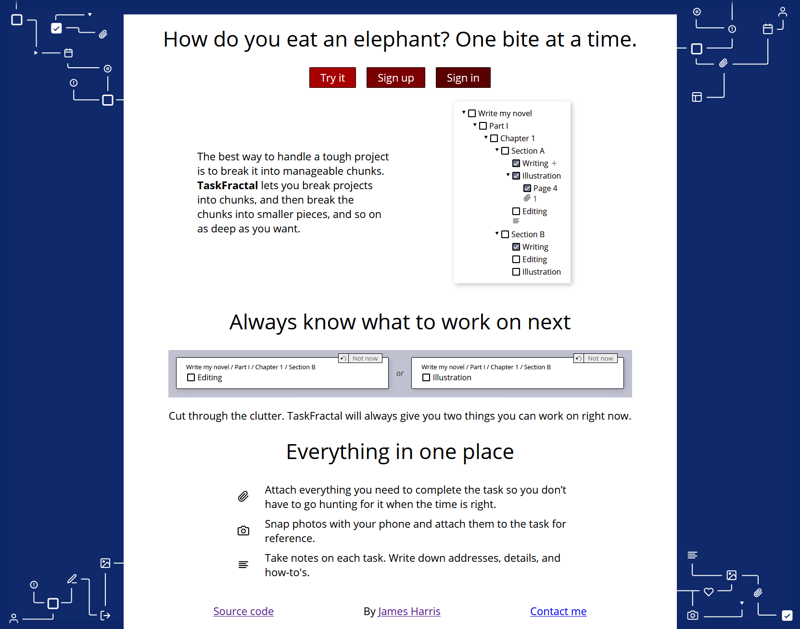
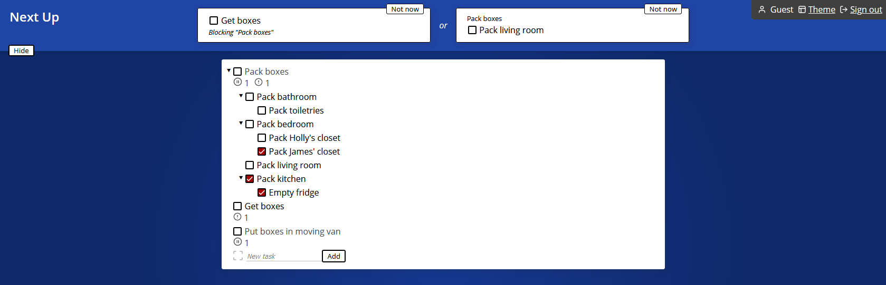
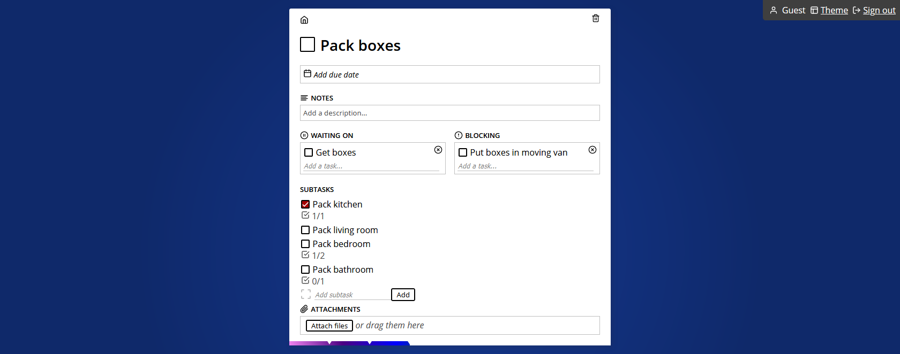
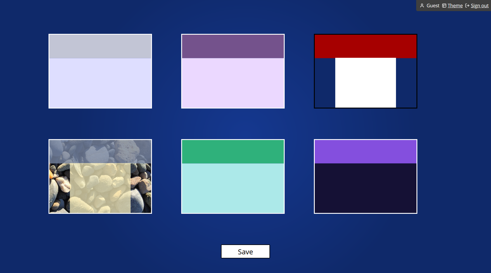

# [TaskFractal](https://taskfractal.com)
**The infinitely nesting task tracker**

This is a project management app designed to let the user break tasks down into chunks as granular as they want. It's built using [React on Rails](https://github.com/shakacode/react_on_rails).

## Walkthrough

### Landing page

Clicking the "Try it" button will log you into the guest account, so you can play around without needing to create an account.

### Outline page

This shows an outline view of all your tasks. You can nest them as deep as you like, and you can attach files to tasks at any level. (Attachments are stored in Azure cloud storage; each user has a 100 MB storage cap for now.)

At the top of the page is "Next Up", which shows you two tasks you can work on immediately - they have no blockers and no uncompleted children. You can click "Not now" to get a different task.

Click on a task to get the details of that task.

### Task page

This shows the details of a particular task and its immediate children. You add details, attach files, or click on the children to see their details. At the bottom is a progress indicator to show how many of the task's descendants are complete.

### Themes page

TaskFractal offers six different themes to display your work. Click one, then click "save" at the bottom.

## Important files

- [/app/javascript/components/Outline.jsx](app/javascript/components/Outline.jsx): React code that renders the Outline page
- [/app/javascript/components/BackSideTask.jsx](app/javascript/components/BackSideTask.jsx): React code that renders the Task page. The metaphor is that each task has a "front side" (the little card summarizing how many attachments, children, etc. it has) and a "back side" that has all the details on it.

## Setup

You'll need to have PostgreSQL and Ruby installed (I'm using Ruby 2.5.3). Clone the repo, then run `bundle install` and `yarn install`. You'll need to create a database named "chunky_development" (Chunky was the project's codename before I named it TaskFractal).

To start the development server, run `npm run dev`.
